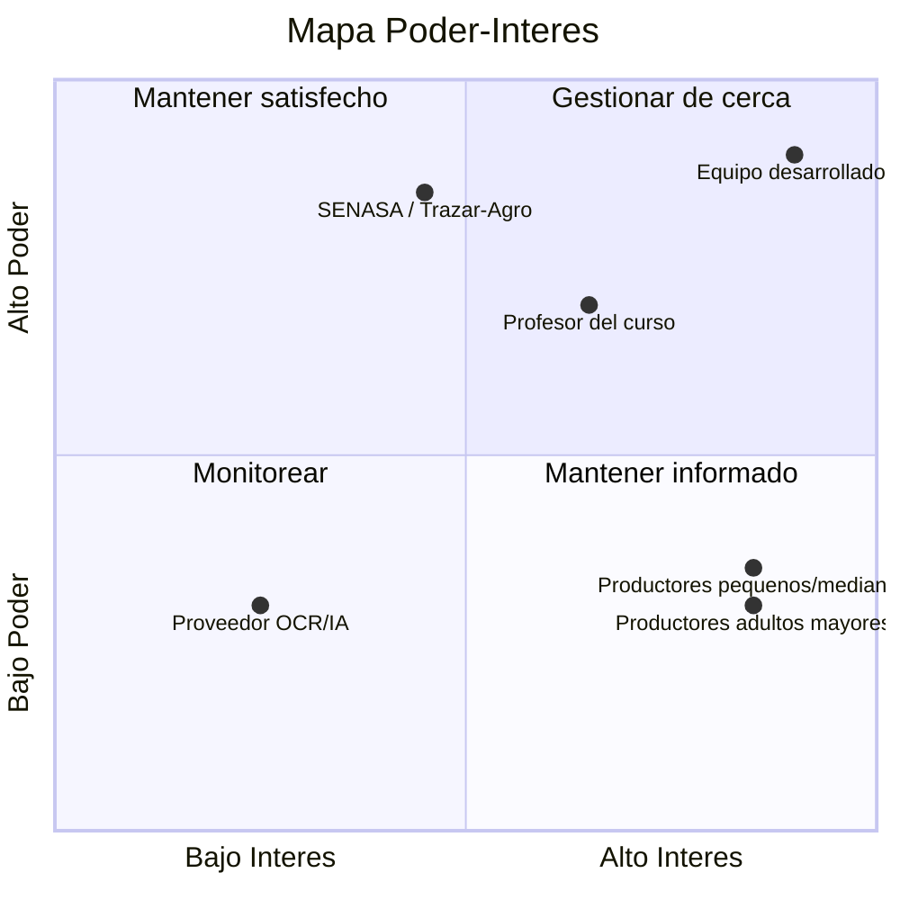

# Plataforma de Registro Individual de Ganado

**Proyecto final — ISW-912 · Administración de Proyectos Informáticos**
Universidad Técnica Nacional · Sede Regional de San Carlos · II Cuatrimestre 2026

**Estudiantes:** Marco López Quesada · Joseph Salazar Araya
**Profesor:** Deiver Cubero Molina

---

## Sección 01 — Propuesta inicial del proyecto

*Semana 1 — Lección 1: Del problema al proyecto*

### 1. Problema

En Costa Rica ya existe un sistema nacional de trazabilidad (Trazar-Agro), pero está
enfocado casi exclusivamente en el cumplimiento sanitario y comercial del ganado bovino
(y recientemente porcino), con datos básicos orientados a movilización y control de
enfermedades. Los productores —especialmente pequeños y medianos, muchos de ellos adultos
mayores con poca familiaridad tecnológica, y quienes manejan varias especies en la misma
finca— no cuentan con una herramienta unificada, detallada y fácil de usar para llevar el
control interno de cada animal (historial de salud, peso, reproducción, fotos,
propietario). Además, el registro manual de datos como el número del arete oficial es
propenso a errores de digitación, y muchas fincas rurales tienen conectividad limitada.

### 2. Interesados identificados

- Productores pequeños y medianos — usuarios principales del sistema.
- Productores adultos mayores — segmento crítico para el diseño de la interfaz, por su
  menor familiaridad tecnológica.
- Propietarios con varias especies en una misma finca — necesitan gestionar distintos
  tipos de animales desde una sola cuenta.
- SENASA / Trazar-Agro — sistema y entidad reguladora nacional con la que el proyecto se
  complementa, sin competir ni duplicar.
- Equipo desarrollador (Marco y Joseph) — responsables de diseñar, construir y validar la
  plataforma.
- Profesor del curso — evalúa el proyecto y actúa como patrocinador académico.

### 3. Necesidad

Los productores necesitan una herramienta unificada, detallada y de uso sencillo para
llevar el control interno de cada animal (salud, peso, reproducción, fotos, propietario),
que funcione con conectividad limitada y que minimice los errores de digitación, en
especial para usuarios sin experiencia tecnológica previa.

### 4. Propuesta de valor

- Control individual y detallado orientado a la gestión propia del productor, no solo al
  cumplimiento regulatorio.
- Trazabilidad clara de propiedad mediante la vinculación de cada animal a una cédula
  (física o jurídica).
- Reducción del tiempo y los errores de digitación gracias al módulo de IA (arete, raza,
  color/patrón), especialmente valioso para usuarios con menor destreza tecnológica.
- Se posiciona como complemento del sistema nacional, no como una copia: para animales sin
  registrar, acelera su primera ficha; para animales ya registrados, evita redigitar lo
  que el arete ya certifica y suma valor donde Trazar-Agro no llega.
- Interfaz simple y accesible, adecuada al perfil real del usuario final (productores
  adultos mayores).

### 5. Objetivo general

Desarrollar una plataforma digital que permita el registro y control individual detallado
del ganado en Costa Rica, organizado por categorías de especie y asociado a un propietario
mediante cédula, con generación automática de código único por animal y un módulo de IA
que agilice el registro mediante fotografía.

### Objetivos específicos

1. Diseñar el modelo de datos multi-especie (bovinos, porcinos, equinos, etc.), incluyendo
   la entidad Propietario (cédula física o jurídica) vinculada a uno o varios animales,
   ficha detallada por animal, foto opcional y generación automática de código único.
2. Implementar un módulo de asistencia por IA que, a partir de la foto del animal,
   extraiga el número de arete mediante OCR cuando exista (usándolo como referencia si el
   animal ya está registrado oficialmente, o como base para iniciar su ficha si no lo
   está), y sugiera raza y color/patrón de pelaje como apoyo al llenado, con corrección
   manual en todos los casos.
3. Diseñar y validar una interfaz de uso simple (pasos guiados, mínima digitación) con
   productores reales o simulados, priorizando la accesibilidad para usuarios adultos
   mayores con poca experiencia en plataformas digitales.

### 6. Producto / resultado esperado

Una plataforma digital de registro individual de ganado, organizada por categorías de
especie (bovinos, porcinos, equinos, etc.), donde cada animal cuenta con una ficha
detallada (nacimiento, raza, color/patrón, sexo, salud, peso, reproducción, foto opcional)
y un código único generado automáticamente. Cada animal queda asociado a un propietario
identificado por cédula, permitiendo administrar varios animales desde una sola cuenta.

### 7. Restricciones

- Conectividad limitada en muchas fincas rurales.
- Perfil de usuario con baja alfabetización digital (adultos mayores): la interfaz debe
  minimizar digitación y pasos.
- El sistema no duplica ni sustituye a Trazar-Agro/SENASA, únicamente lo complementa.
- Equipo de desarrollo de 2 personas y tiempo acotado al calendario del cuatrimestre.

### 8. Riesgos iniciales

- Precisión limitada del OCR ante aretes sucios, dañados o fotos de baja calidad.
- Baja adopción si la interfaz resulta compleja para el perfil real de usuario (adultos
  mayores).
- Dependencia de conectividad para sincronizar datos entre fincas remotas y el sistema.
- Posibles cambios futuros en Trazar-Agro/SENASA que afecten la integración o el uso del
  número de arete como referencia.

---

## Sección 02 — Contexto organizacional del proyecto

*Semana 2 — Contexto del proyecto e interesados*

El proyecto no nace dentro de una empresa u organización existente, sino de un equipo de
2 estudiantes. El análisis de contexto se aplica al equipo del proyecto y al entorno real
donde operará la plataforma: fincas costarricenses y el ecosistema regulatorio
agropecuario.

### Factores ambientales de la empresa (EEF)

**Internos**

- Equipo de 2 desarrolladores (Marco y Joseph), sin estructura jerárquica formal; las
  decisiones se toman en conjunto.
- Tiempo disponible limitado al calendario académico del II Cuatrimestre 2026.
- Presupuesto estudiantil, dependiente de servicios gratuitos o de bajo costo (APIs de
  OCR, hosting).

**Externos**

- Normativa y sistema nacional Trazar-Agro / SENASA: cambios en sus políticas de datos o
  de acceso pueden afectar la integración planteada.
- Conectividad rural limitada en muchas fincas costarricenses.
- Perfil demográfico del usuario final (productores adultos mayores, baja alfabetización
  digital), que condiciona el diseño de la interfaz.
- Disponibilidad y costo de servicios de IA/OCR en la nube (dependencia de terceros).
- Normativa de protección de datos personales (cédula del propietario) aplicable en Costa
  Rica.

### Activos de los procesos de la organización

- Plantillas y herramientas del curso (Project Canvas, este documento, registro de
  interesados, mapa poder-interés).
- Documentación pública de Trazar-Agro/SENASA como referencia para diseñar la
  integración.
- Librerías y servicios de OCR de código abierto o gratuito.

### Estructura organizacional del equipo

Con solo 2 integrantes, la estructura se asemeja a un equipo orientado a proyecto: alta
autonomía, decisiones conjuntas y sin jerarquías funcionales internas. No hay una
gerencia funcional externa que asigne recursos: los propios estudiantes gestionan tiempo,
alcance y tecnología.

### Gobernanza del proyecto

- El profesor actúa como patrocinador y comité de aprobación académico: cualquier cambio
  importante de alcance se justifica ante él.
- Dentro del equipo, las decisiones técnicas y de alcance se toman por consenso entre
  Marco y Joseph.
- Los hitos de entrega semanales del curso funcionan como puntos de control del avance
  del proyecto.

---

## Sección 03 — Interesados: registro y mapa poder-interés

*Semana 2 — Contexto del proyecto e interesados*

### Registro de interesados

| Interesado | Rol / relación | Necesidad | Poder (1-5) | Interés (1-5) | Actitud | Estrategia |
|---|---|---|---|---|---|---|
| Productores pequeños/medianos | Usuarios principales | Control simple y rápido de su ganado | 2 | 5 | Favorable | Informar y validar la interfaz con ellos |
| Productores adultos mayores | Segmento crítico de usuarios | Interfaz sencilla, mínima digitación | 2 | 5 | Mixta | Involucrar en pruebas de usabilidad tempranas |
| SENASA / Trazar-Agro | Entidad reguladora / sistema nacional | Que el proyecto no duplique ni interfiera con el registro oficial | 5 | 3 | Neutral | Mantener informado; diseñar como complemento |
| Equipo desarrollador | Responsables del proyecto | Cumplir los objetivos del curso y del producto | 5 | 5 | Favorable | Gestionar de cerca |
| Profesor del curso | Evaluador / patrocinador académico | Evidencia de aplicación correcta de los conceptos del curso | 4 | 4 | Favorable | Mantener informado con avances semanales |
| Proveedor de servicio OCR/IA | Tercero tecnológico | Uso correcto de su API/servicio | 2 | 2 | Neutral | Monitorear disponibilidad y costos |

### Mapa Poder-Interés

### Restricciones actualizadas

- No duplicar ni competir con Trazar-Agro/SENASA: usarlo como referencia (arete) y
  complementarlo con datos de manejo diario.
- Diseño accesible para usuarios de baja alfabetización digital.
- Conectividad intermitente en zonas rurales.
- Equipo de 2 personas, tiempo limitado al cuatrimestre académico.

### Enfoque de gestión: predictivo, adaptativo o híbrido

Se aplica un enfoque híbrido: la fecha de entrega del curso y el alcance mínimo viable se
planifican de forma predictiva, mientras que el módulo de IA/OCR y el diseño de la
interfaz para productores adultos mayores se desarrollan mediante ciclos cortos de
prueba, retroalimentación real de usuarios y ajuste.

---

## Bibliografía y fuentes base

- Universidad Técnica Nacional. *ISW-912 Administración de Proyectos Informáticos* —
  material de Lección 1, Lección 2 y Semana 2.
- Project Management Institute. *A Guide to the Project Management Body of Knowledge
  (PMBOK® Guide), Eighth Edition.*
- Schwaber, K. & Sutherland, J. *The Scrum Guide.* November 2020.
