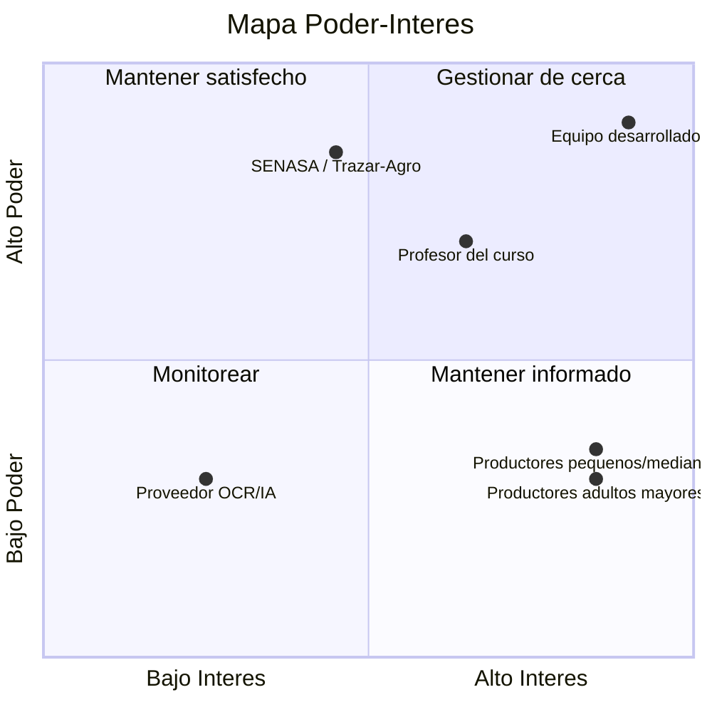

# Plataforma de Registro Individual de Ganado

**Proyecto final — ISW-912 · Administración de Proyectos Informáticos**
Universidad Técnica Nacional · Sede Regional de San Carlos · II Cuatrimestre 2026

**Estudiantes:** Marco López Quesada · Joseph Salazar Araya
**Profesor:** Deiver Cubero Molina

**Aplicación Práctica — Semanas 1-3**

---

## 1. Acta de Inicio (Project Charter)

### Justificación del proyecto

En Costa Rica, el sistema nacional de trazabilidad Trazar-Agro está enfocado casi
exclusivamente en el cumplimiento sanitario y comercial del ganado bovino y porcino, sin
ofrecer a los productores —en particular a los pequeños y medianos, muchos de ellos
adultos mayores con poca familiaridad tecnológica— una herramienta de uso interno para
administrar el historial detallado de cada animal (salud, peso, reproducción,
fotografías, propietario). El registro manual del número de arete es, además, propenso a
errores de digitación, y la conectividad en las fincas rurales suele ser limitada.

El proyecto se justifica porque complementa, sin duplicar, el sistema oficial: ofrece a
los productores una plataforma propia para el control individual de su ganado, con una
interfaz simplificada y un módulo de inteligencia artificial que agiliza el registro
mediante fotografía (lectura del arete, sugerencia de raza y color/patrón), reduciendo el
tiempo y los errores de digitación, especialmente para usuarios con menor destreza
tecnológica.

### Objetivo general

Desarrollar una plataforma digital que permita el registro y control individual detallado
del ganado en Costa Rica, organizado por categorías de especie y asociado a un propietario
mediante cédula, con generación automática de código único por animal y un módulo de IA
que agilice el registro mediante fotografía.

### Objetivos específicos

1. Diseñar el modelo de datos multi-especie (bovinos, porcinos, equinos, etc.), incluyendo
   la entidad Propietario (cédula física o jurídica) vinculada a uno o varios animales,
   ficha detallada por animal, foto opcional y generación automática de código único.
2. Implementar un módulo de asistencia por IA que, a partir de la foto del animal,
   extraiga el número de arete mediante OCR cuando exista (usándolo como referencia si el
   animal ya está registrado oficialmente, o como base para iniciar su ficha si no lo
   está), y sugiera raza y color/patrón de pelaje como apoyo al llenado, con corrección
   manual en todos los casos.
3. Diseñar y validar una interfaz de uso simple (pasos guiados, mínima digitación) con
   productores reales o simulados, priorizando la accesibilidad para usuarios adultos
   mayores con poca experiencia en plataformas digitales.

### Límites generales del proyecto

**Dentro del alcance**

- Registro y gestión de fichas individuales de ganado multi-especie (bovino, porcino,
  equino, etc.).
- Asociación de animales a un propietario mediante cédula física o jurídica.
- Generación automática de código único por animal.
- Módulo de IA/OCR para lectura de arete y sugerencia de raza/color-patrón a partir de
  fotografía.
- Interfaz simplificada orientada a productores con baja alfabetización digital.

**Fuera del alcance**

- Sustitución o duplicación del registro oficial de Trazar-Agro/SENASA.
- Procesos de pago, facturación o comercialización de ganado.
- Módulo veterinario avanzado (diagnósticos, historiales clínicos detallados) en esta
  fase.
- Soporte completamente offline; se asume conectividad intermitente, no ausencia total de
  red.
- Equipo de desarrollo de 2 integrantes, trabajo acotado a las 14 semanas del curso.

---

## 2. Definición del Scrum Team

| Rol | Integrante | Responsabilidades principales |
|---|---|---|
| Product Owner | Marco López Quesada | Define y prioriza el Product Backlog; representa la visión del producto y las necesidades de los productores; decide qué se construye en cada Sprint. |
| Scrum Master | Joseph Salazar Araya | Facilita el proceso Scrum; da seguimiento al Sprint Backlog; elimina obstáculos del equipo; organiza Sprint Planning, Daily Scrum, Sprint Review y Retrospective. |
| Developers | Marco López Quesada y Joseph Salazar Araya | Diseñan, construyen, prueban e integran la solución técnica: modelo de datos, interfaz y módulo de IA/OCR. |

Duración del equipo: 14 semanas, correspondientes a la duración completa del curso.

---

## 3. Análisis de Entorno (Lean Canvas / EEFs)

### Lean Canvas

| Bloque | Contenido |
|---|---|
| Problema | Falta de una herramienta interna, simple y detallada para el control individual del ganado; Trazar-Agro cubre solo trazabilidad sanitaria/comercial; alta tasa de error en digitación manual del arete. |
| Segmentos de clientes | Productores pequeños y medianos; productores adultos mayores; propietarios con varias especies en una misma finca. |
| Propuesta de valor única | Control individual y detallado del ganado, con registro asistido por IA que reduce tiempo y errores de digitación, complementando el sistema nacional sin duplicarlo. |
| Solución | Plataforma multi-especie con ficha por animal, código único, asociación a propietario por cédula y módulo de IA/OCR para lectura de arete y sugerencia de raza/color-patrón. |
| Canales | Aplicación web/móvil; difusión a través de cooperativas y asociaciones de productores agropecuarios. |
| Flujos de ingreso | Proyecto académico, sin modelo de ingresos definido en esta etapa. |
| Estructura de costos | Tiempo de desarrollo del equipo (2 estudiantes); hosting; costo de servicios de OCR/IA en la nube. |
| Métricas clave | Número de animales registrados; tasa de precisión del OCR; tasa de adopción en pruebas con usuarios reales o simulados. |
| Ventaja injusta | Diseño construido específicamente para el contexto costarricense (conectividad limitada, usuarios adultos mayores) e integración conceptual con Trazar-Agro/SENASA. |

### Factores Ambientales de la Empresa (EEF)

**Internos**

- Equipo de 2 desarrolladores (Marco y Joseph), sin estructura jerárquica formal; las
  decisiones se toman en conjunto.
- Tiempo disponible limitado al calendario académico de 14 semanas.
- Presupuesto estudiantil, dependiente de servicios gratuitos o de bajo costo (APIs de
  OCR, hosting).

**Externos**

- Normativa y sistema nacional Trazar-Agro / SENASA: cambios en sus políticas de datos o
  de acceso pueden afectar la integración planteada.
- Conectividad rural limitada en muchas fincas costarricenses.
- Perfil demográfico del usuario final (productores adultos mayores, baja alfabetización
  digital), que condiciona el diseño de la interfaz.
- Disponibilidad y costo de servicios de IA/OCR en la nube (dependencia de terceros).
- Normativa de protección de datos personales (cédula del propietario) aplicable en Costa
  Rica.

### Registro de interesados

| Interesado | Rol / relación | Necesidad | Poder (1-5) | Interés (1-5) | Actitud | Estrategia |
|---|---|---|---|---|---|---|
| Productores pequeños/medianos | Usuarios principales | Control simple y rápido de su ganado | 2 | 5 | Favorable | Informar y validar la interfaz con ellos |
| Productores adultos mayores | Segmento crítico de usuarios | Interfaz sencilla, mínima digitación | 2 | 5 | Mixta | Involucrar en pruebas de usabilidad tempranas |
| SENASA / Trazar-Agro | Entidad reguladora / sistema nacional | Que el proyecto no duplique ni interfiera con el registro oficial | 5 | 3 | Neutral | Mantener informado; diseñar como complemento |
| Equipo desarrollador | Responsables del proyecto | Cumplir los objetivos del curso y del producto | 5 | 5 | Favorable | Gestionar de cerca |
| Profesor del curso | Evaluador / patrocinador académico | Evidencia de aplicación correcta de los conceptos del curso | 4 | 4 | Favorable | Mantener informado con avances semanales |
| Proveedor de servicio OCR/IA | Tercero tecnológico | Uso correcto de su API/servicio | 2 | 2 | Neutral | Monitorear disponibilidad y costos |

### Mapa Poder-Interés

---

## Bibliografía y fuentes base

- Universidad Técnica Nacional. *ISW-912 Administración de Proyectos Informáticos* —
  material de Lección 1, Lección 2 y Semana 2.
- Project Management Institute. *A Guide to the Project Management Body of Knowledge
  (PMBOK® Guide), Eighth Edition.*
- Schwaber, K. & Sutherland, J. *The Scrum Guide.* November 2020.