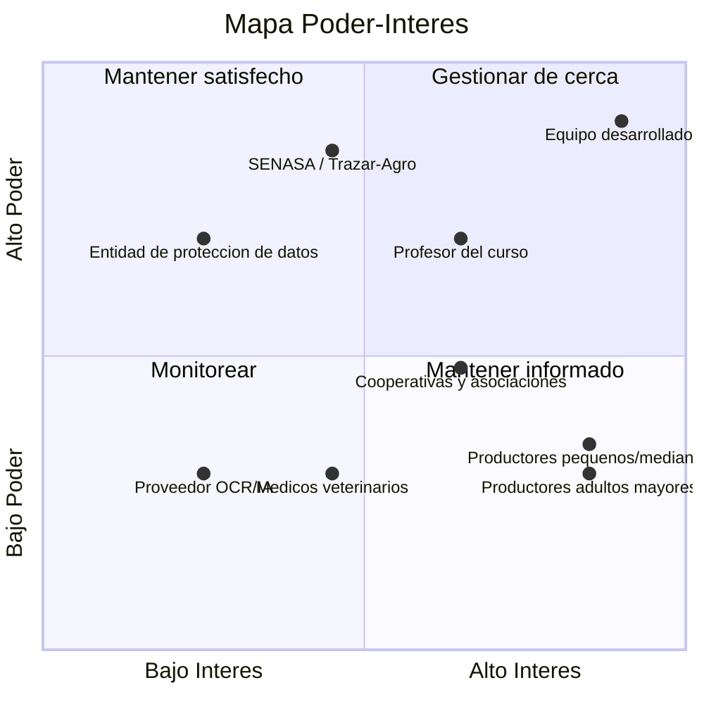

# Plataforma de Registro Individual de Ganado

## Sección 00 — Portada e identificación del equipo

**Proyecto final — ISW-912 · Administración de Proyectos Informáticos**
Universidad Técnica Nacional · Sede Regional de San Carlos · II Cuatrimestre 2026

**Estudiantes:** Marco López Quesada · Joseph Salazar Araya
**Profesor:** Deiver Cubero Molina

### Definición del Scrum Team

| Rol | Integrante | Responsabilidades principales |
|---|---|---|
| Product Owner | Marco López Quesada | Define y prioriza el Product Backlog; representa la visión del producto y las necesidades de los productores; decide qué se construye en cada Sprint. |
| Scrum Master | Joseph Salazar Araya | Facilita el proceso Scrum; da seguimiento al Sprint Backlog; elimina obstáculos del equipo; organiza Sprint Planning, Daily Scrum, Sprint Review y Retrospective. |
| Developers | Marco López Quesada y Joseph Salazar Araya | Diseñan, construyen, prueban e integran la solución técnica: modelo de datos, interfaz y módulo de IA/OCR. |

Duración del equipo: 14 semanas, correspondientes a la duración completa del curso.

---

## Sección 01 — Problema, oportunidad y Product Goal

### Acta de Inicio (Project Charter)

#### Justificación del proyecto

En Costa Rica, el sistema nacional de trazabilidad Trazar-Agro está enfocado casi
exclusivamente en el cumplimiento sanitario y comercial del ganado bovino y porcino, sin
ofrecer a los productores —en particular a los pequeños y medianos, muchos de ellos
adultos mayores con poca familiaridad tecnológica— una herramienta de uso interno para
administrar el historial detallado de cada animal (salud, peso, reproducción,
fotografías, propietario). El registro manual del número de arete es, además, propenso a
errores de digitación, y la conectividad en las fincas rurales suele ser limitada.

El proyecto se justifica porque complementa, sin duplicar, el sistema oficial: ofrece a
los productores una plataforma propia para el control individual de su ganado, con una
interfaz simplificada y un módulo de inteligencia artificial que agiliza el registro
mediante fotografía (lectura del arete, sugerencia de raza y color/patrón), reduciendo el
tiempo y los errores de digitación, especialmente para usuarios con menor destreza
tecnológica.

#### Objetivo general

Desarrollar una plataforma digital que permita el registro y control individual detallado
del ganado en Costa Rica, organizado por categorías de especie y asociado a un propietario
mediante cédula, con generación automática de código único por animal y un módulo de IA
que agilice el registro mediante fotografía.

#### Objetivos específicos

1. Diseñar el modelo de datos multi-especie (bovinos, porcinos, equinos, etc.), incluyendo
   la entidad Propietario (cédula física o jurídica) vinculada a uno o varios animales,
   ficha detallada por animal, foto opcional y generación automática de código único.
2. Implementar un módulo de asistencia por IA que, a partir de la foto del animal,
   extraiga el número de arete mediante OCR cuando exista (usándolo como referencia si el
   animal ya está registrado oficialmente, o como base para iniciar su ficha si no lo
   está), y sugiera raza y color/patrón de pelaje como apoyo al llenado, con corrección
   manual en todos los casos.
3. Diseñar y validar una interfaz de uso simple (pasos guiados, mínima digitación) con
   productores reales o simulados, priorizando la accesibilidad para usuarios adultos
   mayores con poca experiencia en plataformas digitales.

#### Límites generales del proyecto

**Dentro del alcance**

- Registro y gestión de fichas individuales de ganado multi-especie (bovino, porcino,
  equino, etc.).
- Asociación de animales a un propietario mediante cédula física o jurídica.
- Generación automática de código único por animal.
- Módulo de IA/OCR para lectura de arete y sugerencia de raza/color-patrón a partir de
  fotografía.
- Interfaz simplificada orientada a productores con baja alfabetización digital.

**Fuera del alcance**

- Sustitución o duplicación del registro oficial de Trazar-Agro/SENASA.
- Procesos de pago, facturación o comercialización de ganado.
- Módulo veterinario avanzado (diagnósticos, historiales clínicos detallados) en esta
  fase.
- Soporte completamente offline; se asume conectividad intermitente, no ausencia total de
  red.
- Equipo de desarrollo de 2 integrantes, trabajo acotado a las 14 semanas del curso.

### Product Goal

Una plataforma digital de registro y control individual detallado del ganado en Costa
Rica, organizada por categorías de especie, con cada animal asociado a un propietario
mediante cédula, código único generado automáticamente y un módulo de IA que agilice el
registro mediante fotografía.

---

## Sección 02 — Contexto organizacional y restricciones

### Lean Canvas

| Bloque | Contenido |
|---|---|
| Problema | Falta de una herramienta interna, simple y detallada para el control individual del ganado; Trazar-Agro cubre solo trazabilidad sanitaria/comercial; alta tasa de error en digitación manual del arete. |
| Segmentos de clientes | Productores pequeños y medianos; productores adultos mayores; propietarios con varias especies en una misma finca. |
| Propuesta de valor única | Control individual y detallado del ganado, con registro asistido por IA que reduce tiempo y errores de digitación, complementando el sistema nacional sin duplicarlo. |
| Solución | Plataforma multi-especie con ficha por animal, código único, asociación a propietario por cédula y módulo de IA/OCR para lectura de arete y sugerencia de raza/color-patrón. |
| Canales | Aplicación web/móvil; difusión a través de cooperativas y asociaciones de productores agropecuarios. |
| Flujos de ingreso | Proyecto académico, sin modelo de ingresos definido en esta etapa. |
| Estructura de costos | Tiempo de desarrollo del equipo (2 estudiantes); hosting; costo de servicios de OCR/IA en la nube. |
| Métricas clave | Número de animales registrados; tasa de precisión del OCR; tasa de adopción en pruebas con usuarios reales o simulados. |
| Ventaja injusta | Diseño construido específicamente para el contexto costarricense (conectividad limitada, usuarios adultos mayores) e integración conceptual con Trazar-Agro/SENASA. |

### Factores Ambientales de la Empresa (EEF)

**Internos**

- Equipo de 2 desarrolladores (Marco y Joseph), sin estructura jerárquica formal; las
  decisiones se toman en conjunto.
- Tiempo disponible limitado al calendario académico de 14 semanas.
- Presupuesto estudiantil, dependiente de servicios gratuitos o de bajo costo (APIs de
  OCR, hosting).

**Externos**

- Normativa y sistema nacional Trazar-Agro / SENASA: cambios en sus políticas de datos o
  de acceso pueden afectar la integración planteada.
- Conectividad rural limitada en muchas fincas costarricenses.
- Perfil demográfico del usuario final (productores adultos mayores, baja alfabetización
  digital), que condiciona el diseño de la interfaz.
- Disponibilidad y costo de servicios de IA/OCR en la nube (dependencia de terceros).
- Normativa de protección de datos personales (cédula del propietario) aplicable en Costa
  Rica.

### Tipo de estructura organizacional

Orientada a proyectos: equipo de 2 integrantes, sin estructura jerárquica formal; las
decisiones se toman en conjunto.

### Restricciones

- Equipo de desarrollo de 2 integrantes, trabajo acotado a las 14 semanas del curso.
- Presupuesto estudiantil, dependiente de servicios gratuitos o de bajo costo (APIs de
  OCR, hosting).
- Conectividad rural limitada en muchas fincas costarricenses.
- Perfil demográfico del usuario final (productores adultos mayores, baja alfabetización
  digital), que condiciona el diseño de la interfaz.
- El proyecto complementa, sin duplicar, el sistema oficial.

---

## Sección 03 — Interesados / stakeholders

### Registro de interesados

| Interesado | Rol / relación | Necesidad | Poder (1-5) | Interés (1-5) | Actitud | Estrategia | Responsable |
|---|---|---|---|---|---|---|---|
| Productores pequeños/medianos | Usuarios principales | Control simple y rápido de su ganado | 2 | 5 | Favorable | Informar y validar la interfaz con ellos | Marco López Quesada |
| Productores adultos mayores | Segmento crítico de usuarios | Interfaz sencilla, mínima digitación | 2 | 5 | Mixta | Involucrar en pruebas de usabilidad tempranas | Marco López Quesada |
| SENASA / Trazar-Agro | Entidad reguladora / sistema nacional | Que el proyecto no duplique ni interfiera con el registro oficial | 5 | 3 | Neutral | Mantener informado; diseñar como complemento | Joseph Salazar Araya |
| Equipo desarrollador | Responsables del proyecto | Cumplir los objetivos del curso y del producto | 5 | 5 | Favorable | Gestionar de cerca | Marco López Quesada y Joseph Salazar Araya |
| Profesor del curso | Evaluador / patrocinador académico | Evidencia de aplicación correcta de los conceptos del curso | 4 | 4 | Favorable | Mantener informado con avances semanales | Joseph Salazar Araya |
| Proveedor de servicio OCR/IA | Tercero tecnológico | Uso correcto de su API/servicio | 2 | 2 | Neutral | Monitorear disponibilidad y costos | Joseph Salazar Araya |
| Cooperativas y asociaciones de productores | Canal de difusión entre productores | Que la herramienta sea útil para sus asociados y fácil de recomendar | 3 | 4 | Favorable | Mantener informado y consultar sobre la difusión | Marco López Quesada |
| Médicos veterinarios y asistentes técnicos | Usuarios secundarios; apoyo a los productores | Consultar con claridad los datos individuales de cada animal | 2 | 3 | Neutral | Monitorear y considerar su opinión sobre los datos de la ficha | Marco López Quesada |
| Entidad de protección de datos personales | Entidad reguladora | Que el manejo de la cédula del propietario cumpla la normativa | 4 | 2 | Neutral | Mantener satisfecho; aplicar la normativa en el diseño de los datos | Joseph Salazar Araya |

### Justificación de las valoraciones discutibles

- **SENASA / Trazar-Agro (poder 5, interés 3):** su normativa y su sistema oficial pueden
  condicionar el diseño del producto, por eso el poder es alto; el interés es moderado
  porque la plataforma es una herramienta de uso interno del productor que complementa el
  sistema oficial y no sustituye ningún trámite.
- **Productores adultos mayores (poder 2, actitud mixta):** su poder de decisión sobre el
  proyecto es bajo, pero de su adopción depende el cumplimiento del tercer objetivo
  específico; la actitud es mixta por su poca familiaridad con plataformas digitales.
- **Cooperativas y asociaciones de productores (poder 3, interés 4):** no deciden el alcance
  del producto, pero pueden facilitar o dificultar su difusión entre los asociados.
- **Entidad de protección de datos personales (poder 4, interés 2):** puede exigir el
  cumplimiento de la normativa sobre la cédula del propietario, pero no sigue de cerca el
  avance del proyecto.

### Mapa Poder-Interés

### Interesados críticos

| Interesado crítico | Por qué es crítico | Forma de involucramiento |
|---|---|---|
| Productores adultos mayores | De su adopción depende el cumplimiento del tercer objetivo específico y es el segmento con menor familiaridad tecnológica. | Pruebas de usabilidad tempranas del registro guiado con productores reales o simulados; sus observaciones se incorporan al Product Backlog y se revisan al cierre de cada Sprint. |
| SENASA / Trazar-Agro | Su normativa y su sistema oficial determinan que el producto sea un complemento y no un duplicado del registro oficial. | Consulta de su información pública al definir cada Sprint, para confirmar que el alcance complementa el registro oficial sin duplicarlo. |
| Profesor del curso | Evalúa cada entrega del Expediente, del repositorio y de la demostración. | Avance semanal del Expediente y del repositorio, y atención de su retroalimentación en el Sprint siguiente. |

---

## Sección 04 — Ciclo de vida del proyecto y primer Sprint

### Ciclo de vida del proyecto

El proyecto nace del problema descrito en la Sección 01: el sistema nacional Trazar-Agro
cubre el cumplimiento sanitario y comercial, pero los productores no cuentan con una
herramienta propia, detallada y fácil de usar para el control individual de cada animal.

La fecha de la entrega oficial es fija (Semana 11) y el alcance se construye de forma
adaptativa mediante 5 Sprints de 2 semanas, por lo que el ciclo de vida del proyecto es
híbrido.

El trabajo avanza por tres líneas, tomadas de los objetivos específicos:

1. Modelo de datos y registro individual: modelo multi-especie, propietario por cédula,
   ficha por animal y código único.
2. Módulo de asistencia por IA: lectura del arete mediante OCR y sugerencia de raza y
   color/patrón, con corrección manual.
3. Interfaz simple y validación: pasos guiados y mínima digitación, validados con
   productores reales o simulados.

El cierre del proyecto consiste en la entrega oficial del Expediente completo, la
demostración del incremento y la defensa ante el docente en la Semana 11.

### Primer Sprint

**Duración:** 2 semanas (Sprint 1 de 5).

**Sprint Goal:** Permitir al productor registrar un animal asociado a un propietario
identificado por cédula, con su código único generado automáticamente, y consultar su
ficha. Todo lo demás queda para futuros Sprints.

**Historias que se atacan primero**

- HU-01 Registro de propietario por cédula.
- HU-02 Registro de animal asociado a un propietario.
- HU-03 Código único por animal.
- HU-04 Consulta de la ficha del animal.

**Por qué estas historias:** son la base de la que dependen las demás. Sin propietario y
animal registrados no hay a qué asociar la fotografía, la lectura del arete ni las
sugerencias del módulo de IA.

---

## Sección 05 — Backlog inicial y Sprint Backlog

### Backlog inicial

El backlog está ordenado por valor para el productor y por dependencia entre historias.

| ID | Historia de usuario | Prioridad |
|---|---|---|
| HU-01 | Como productor, quiero registrar a un propietario por su cédula física o jurídica para asociarle sus animales. | Alta |
| HU-02 | Como productor, quiero registrar un animal en su categoría de especie, asociado a un propietario, para llevar su control individual. | Alta |
| HU-03 | Como productor, quiero que cada animal reciba un código único generado automáticamente para identificarlo sin duplicados. | Alta |
| HU-04 | Como productor, quiero consultar la ficha de un animal registrado para ver sus datos. | Alta |
| HU-05 | Como productor, quiero administrar varios animales de un mismo propietario desde una sola cuenta. | Media |
| HU-06 | Como productor, quiero completar la ficha detallada del animal con su salud, peso y reproducción. | Media |
| HU-07 | Como productor, quiero adjuntar una fotografía opcional del animal. | Media |
| HU-08 | Como productor, quiero que la plataforma lea el número de arete a partir de la fotografía (OCR) para reducir errores de digitación. | Media |
| HU-09 | Como productor, quiero recibir sugerencias de raza y de color/patrón de pelaje a partir de la fotografía para completar la ficha con menos esfuerzo. | Media |
| HU-10 | Como productor, quiero corregir manualmente los datos sugeridos por el módulo de IA. | Media |
| HU-11 | Como productor, quiero registrar un animal mediante pasos guiados y con mínima digitación. | Media |
| HU-12 | Como productor, quiero que, si el animal ya está registrado oficialmente, el número de arete se use como referencia para complementar su ficha sin duplicar el registro oficial. | Media |

### Sprint Backlog del primer Sprint

**Sprint Goal:** Permitir al productor registrar un animal asociado a un propietario
identificado por cédula, con su código único generado automáticamente, y consultar su
ficha.

| Historia | Plan de entrega |
|---|---|
| HU-01 | Definir los datos del propietario (cédula física o jurídica) y su registro. |
| HU-02 | Definir la ficha del animal por categoría de especie y su registro asociado a un propietario. |
| HU-03 | Definir la regla de generación automática del código único. |
| HU-04 | Mostrar la ficha del animal registrado con sus datos. |

### Mecanismo de seguimiento

El Sprint Backlog se sigue en un tablero con las columnas Por hacer, En curso y Hecho, que
se actualiza en un Daily Scrum breve. El Scrum Master organiza el Daily Scrum y da
seguimiento al Sprint Backlog.

---

## Sección 06 — Alcance, Product Backlog priorizado y criterios de aceptación

### Declaración de alcance

El alcance incluye el registro y control individual del ganado multi-especie, la asociación
de cada animal a un propietario mediante cédula, la generación automática del código único
y el módulo de IA/OCR para la lectura del arete y la sugerencia de raza y color/patrón.
Excluye la sustitución o duplicación del registro oficial de Trazar-Agro/SENASA. Los
límites generales del proyecto se detallan en la Sección 01.

### Product Backlog priorizado

### Criterios de aceptación

---

## Sección 07 — Planificación temporal, estimaciones y costos

### Plan temporal

### Estimaciones

### Cronograma de entregas

El proyecto se organiza en 5 Sprints de 2 semanas. La entrega oficial del Expediente
completo y la demostración del incremento se realizan en la Semana 11.

### Costos

---

## Sección 08 — Riesgos y adquisiciones

### Registro de riesgos

### Respuestas a los riesgos

### Plan de adquisiciones

---

## Sección 09 — Calidad y Definition of Done

### Criterios de calidad

Toda sugerencia generada por el módulo de IA puede corregirse manualmente.

### Definition of Done

### Estrategia de validación

La interfaz se valida con productores reales o simulados, priorizando la accesibilidad
para usuarios adultos mayores con poca experiencia en plataformas digitales.

---

## Sección 10 — Comunicación y responsabilidades del equipo

### Matriz de responsabilidades

Los roles y las responsabilidades del Scrum Team (Product Owner, Scrum Master y
Developers) se definen en la Sección 00.

### Plan de comunicación

### Working Agreements

---

## Bibliografía y fuentes base

- Universidad Técnica Nacional. *ISW-912 Administración de Proyectos Informáticos* —
  material de Lección 1, Lección 2 y Semana 2.
- Project Management Institute. *A Guide to the Project Management Body of Knowledge
  (PMBOK® Guide), Eighth Edition.*
- Schwaber, K. & Sutherland, J. *The Scrum Guide.* November 2020.